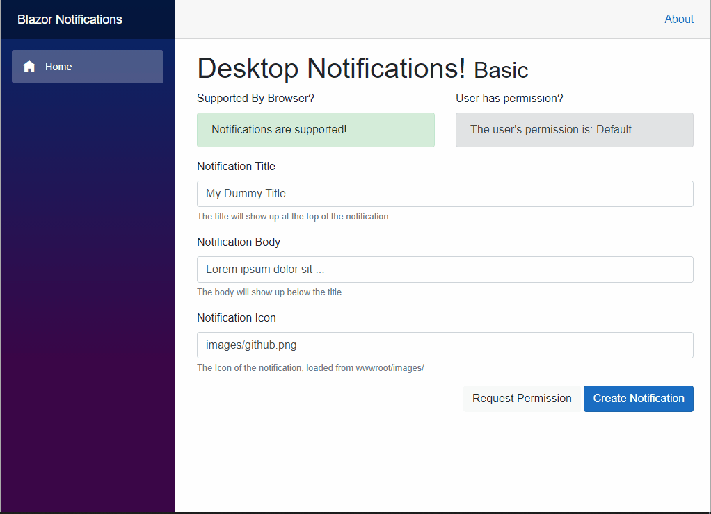

# Notifications
Implementation of the [Notification API](https://developer.mozilla.org/en-US/docs/Web/API/notification) in C# for [Microsoft Blazor](https://github.com/aspnet/Blazor).

[](https://www.nuget.org/packages/Append.Blazor.Notifications)
[](https://www.nuget.org/packages/Append.Blazor.Notifications)
[](https://github.com/Append-IT/Blazor.Notifications/blob/main/LICENSE)

## Preview


## Installation

```
Install-Package Append.Blazor.Notifications
```

## Demo
There is a sample application in /docs folder which is also hosted as [documentation](https://agreeable-rock-071180b03.azurestaticapps.net). 
> For some other references of what the API does see the example [demo](https://web-push-book.gauntface.com/demos/notification-examples/)

## Usage

### Add `INotificationService` via DI
> Scoped by default.
```csharp
public void ConfigureServices(IServiceCollection services)
{
    services.AddNotifications();
}
```

### Inject into component/pages
```csharp
@using Append.Blazor.Notifications
@inject INotificationService NotificationService
```

or

### Inject on a `BlazorComponent` class:

```c#
[Inject] private INotificationService _notificationService { get; set; }
```

 ### Browser Support
```csharp
bool IsSupportedByBrowser = await NotificationService.IsSupportedByBrowserAsync()
```

### Request Permission
```csharp
PermissionType permission = await NotificationService.RequestPermissionAsync();
```

### Check Notification Permission Status
```csharp
PermissionType permission = NotificationService.PermissionStatus;
```

### Create a notification
#### Using a Function (basic)
```csharp
await NotificationService.CreateAsync("Title", "Description", "images/github.png");
```

#### Using NotificationOptions (advanced)
```csharp
NotificationOptions options = new NotificationOptions
{
    Body = body,
    Icon = icon,
};

await NotificationService.CreateAsync(title, options);
```


# Contributions and feedback

Please feel free to use the component, open issues, fix bugs or provide feedback.

# Contributors

This project is created and maintained by:

- [Benjamin Vertonghen](https://github.com/vertonghenb)
